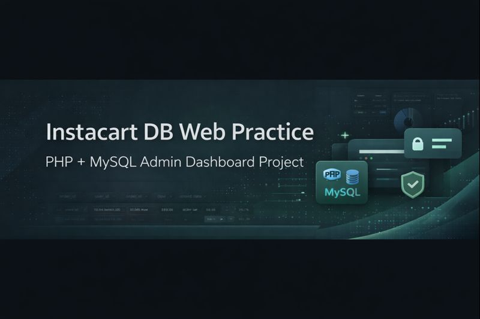
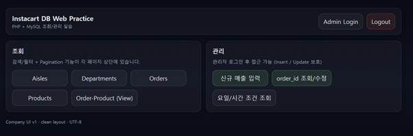
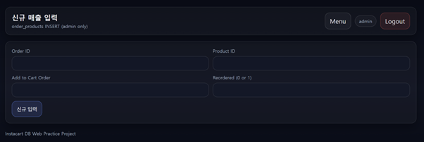

<p align="center">
  
</p>

<h1 align="center">Instacart DB Web Practice Project</h1>

<p align="center">
  PHP · MySQL 기반 주문 데이터 조회 및 관리 웹 시스템  
</p>

<p align="center">
  
  
  
  
</p>

---

## Project Overview

본 프로젝트는 **PHP와 MySQL을 활용한 주문(Order) 데이터 조회·관리 웹 시스템**입니다.  
단순 CRUD 구현이 아닌, **Pagination, 조건 검색, Prepared Statement, 관리자 인증 구조까지 포함한 실무형 구조 학습**을 목표로 제작되었습니다.

Instacart 공개 데이터 구조를 참고하여 **실제 Admin Dashboard 형태의 데이터 관리 흐름**을 구현했습니다.

---

## Core Features

### 데이터 조회 기능

- Aisles 테이블 조회
- Departments 테이블 조회
- Orders 테이블 조회
- Products 테이블 조회
- Order + Product + Date 통합 View 조회

---

### 조건 기반 필터링

- 상품명 부분 검색 (LIKE 검색)
- 요일(Day of Week) + 시간(Hour) 조건 조회
- Order ID 기반 단일 주문 조회
- Pagination 기반 대용량 데이터 분할 처리

---

### 데이터 관리 기능

- 신규 주문(order_products) 데이터 입력
- Order ID 기반 주문 수정
- 관리자 로그인(Session) 인증 후 관리 기능 접근 제한

---

## UI Preview (Screenshots)

> `screenshots/` 폴더 생성 후 아래 파일명으로 이미지 넣으면 자동 반영됨

### ▶ Main Dashboard



---

### ▶ Aisles 조회 + Pagination + 검색


---

### ▶ Orders 조회 화면


---

### ▶ 관리자 데이터 입력 화면



---

## Tech Stack

| Category | Technology |
---------|------------
Backend | PHP (mysqli)
Database | MySQL (InnoDB)
Server | Apache (XAMPP)
Frontend | HTML + Custom CSS UI
Security | Prepared Statement
Auth | PHP Session 기반 인증

---

## Project Structure

```bash
order_page/
┣ PHP/
┃ ┣ db.php
┃ ┣ styles.css
┃ ┣ lib.php
┃ ┣ main.html
┃ ┣ aisles_select.php
┃ ┣ departments_select.php
┃ ┣ orders_select.php
┃ ┣ products_select.php
┃ ┣ order_product_date_select.php
┃ ┣ send.html
┃ ┣ receive.php
┃ ┣ insert.php
┃ ┣ insert_result.php
┃ ┣ orders_num.html
┃ ┣ orders_num_receive.php
┃ ┣ orders_num_update.php
┃ ┣ admin_login.php
┃ ┣ logout.php
┗ SQL/
┣ aisles.sql
┣ departments.sql
┣ orders.sql
┣ products.sql
┣ order_products.sql
```

---

## Database Configuration

### Database Name
```
hmwkdb
```


### db.php Example
```
<?php
$con = mysqli_connect("localhost", "root", "", "hmwkdb");
mysqli_set_charset($con, "utf8");

if(!$con){
  die("DB Connection Failed: ".mysqli_connect_error());
}
?>
```

---

## Execution Method

### XAMPP 실행

- Apache Start
- MySQL Start

### 프로젝트 위치
```
C:\xampp\htdocs\order_page\PHP
```

### 브라우저 접속
```
http://localhost/order_page/PHP/main.html
```

---

## What I Learned

본 프로젝트를 통해 다음 내용을 직접 구현하며 학습했습니다.

1. 관계형 데이터베이스 설계 및 외래키 구조 이해
2. PHP ↔ MySQL 데이터 흐름 처리 구조
3. Pagination 쿼리 설계 및 OFFSET / LIMIT 활용
4. Prepared Statement 기반 SQL Injection 방어
5. 관리자 인증(Session) 기반 권한 제어 구조
6. Admin Dashboard 형태의 UI 구성 경험

---

## Future Improvements

다중 조건 필터 UI 확장

AJAX 기반 비동기 페이지 전환

사용자 Role 분리(Admin / Viewer)

로그 기록 테이블 구축

REST API 구조로 확장

---

## ⚠ Note

본 프로젝트는 학습 목적의 개인 실습 프로젝트이며 
상용 서비스 목적이 아닌 데이터베이스 구조 및 서버 연동 흐름 이해를 목표로 제작되었습니다.
